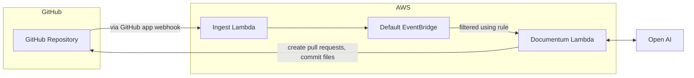

```
# Evergreen Docs

Evergreen Docs est une application Github qui facilite le processus de mise à jour de la documentation de votre dépôt. En utilisant les capacités linguistiques avancées de Chat GPT et en s'intégrant à Github, Evergreen Docs peut mettre à jour automatiquement votre documentation à mesure que votre code évolue.

Avec ses paramètres hautement configurables via un fichier evergreen.config.json, Evergreen Docs peut être adapté à vos besoins spécifiques. Notre équipe travaille également sur une application web qui vous permettra de personnaliser davantage l'application, ainsi que de poser des questions sur votre dépôt et de recevoir des réponses.

## Fonctionnalités (actuelles et prévues)

- [x] Générer automatiquement une documentation mise à jour pour votre dépôt en utilisant Chat GPT et ouvrir une Pull Request avec les modifications
- [ ] Générer des commentaires sur votre code en utilisant Chat GPT et ouvrir une Pull Request avec le code mis à jour
- [ ] Utiliser un assistant de chat bot pour répondre aux questions sur votre dépôt

## Commencer avec l'application GitHub

### Installation

Pour installer Evergreen Docs, rendez-vous simplement sur le [GitHub Marketplace](https://github.com/apps/evergreen-docs) et cliquez sur le bouton "Installer". De là, vous pouvez choisir les dépôts sur lesquels vous souhaitez installer l'application et terminer le processus d'installation.

### Préparer votre dépôt

#### Fichier `evergreeen.config.json`

Avant de pouvoir utiliser Evergreen Docs, vous devez créer un fichier evergreen.config.json à la racine de votre dépôt. Ce fichier contient les paramètres de configuration de l'application, tels que le nom du dépôt, la description et les sections de la documentation à générer.

Voici un exemple de fichier evergreen.config.json:

```jsonc
{
  "name": "Evergreen Docs",
  "description": "Your description here",
  "generates": [
    {
      "preset": "readme",
      "path": "README.md",
      "sections": [
        { "name": "Overview" }
        // ...
      ]
    }
  ]
}
```

Une fois que vous avez créé le fichier evergreen.config.json, il vous suffit de le commiter dans votre dépôt dans la branche principale. L'application générera automatiquement une Pull Request avec votre documentation mise à jour dans les 10 minutes.

## Exécution locale

### Prérequis

- [Node.js](https://nodejs.org/en/)
- [Yarn](https://yarnpkg.com/)

### Installation

1. Clonez le repo

```sh
git clone https://github.com/EvergreenDocs/EvergreenDocs
```

2. Installez les packages NPM

```sh
yarn install
```

3. Définissez les variables d'environnement (assurez-vous que votre environnement cli aws est configuré)

```sh
export OPENAI_API_KEY=<your OpenAI API key>
export SST_STAG=<one of the development stages>
```

4. Exécutez l'application

```sh
yarn sst:dev
```

5. Déclenchez les événements GitHub

## Déploiement

Pour déployer l'application, vous devez avoir installé le [Serverless Stack CLI](https://serverless-stack.com/). Une fois que vous avez installé le CLI, vous pouvez déployer l'application en exécutant la commande suivante:

```sh
yarn deploy
```

## Architecture



## Licence

Distribué sous la licence MIT. Voir `LICENSE` pour plus d'informations.
```

Please translate the above text to the ISO 639-1 code de:

```
# Evergreen Docs

Evergreen Docs ist eine Github-App, die den Prozess der Aktualisierung der Dokumentation Ihres Repositorys vereinfacht. Durch die Nutzung der erweiterten Sprachfunktionen von Chat GPT und die Integration mit Github kann Evergreen Docs Ihre Dokumentation automatisch aktualisieren, während Ihr Code sich entwickelt.

Mit seinen hochgradig konfigurierbaren Einstellungen über eine evergreen.config.json-Datei kann Evergreen Docs Ihren spezifischen Anforderungen angepasst werden. Unser Team arbeitet auch an einer Web-Anwendung, mit der Sie die App weiter anpassen können, sowie Fragen zu Ihrem Repository stellen und Antworten erhalten können.

## Funktionen (aktuell und geplant)

- [x] Erstellen Sie automatisch aktualisierte Dokumentation für Ihr Repository mit Chat GPT und öffnen Sie einen Pull Request mit den Änderungen
- [ ] Erstellen Sie Kommentare zu Ihrem Code mit Chat GPT und öffnen Sie einen Pull Request mit dem aktualisierten Code
- [ ] Verwenden Sie einen Chat-Bot-Assistenten zum Beantworten von Fragen zu Ihrem Repository

## Erste Schritte mit der GitHub App

### Installation

Um Evergreen Docs zu installieren, besuchen Sie einfach den [GitHub Marketplace](https://github.com/apps/evergreen-docs) und klicken Sie auf die Schaltfläche "Installieren". Von dort aus können Sie die Repositories auswählen, auf denen Sie die App installieren möchten, und den Installationsprozess abschließen.

### Vorbereiten Ihres Repositorys

#### `evergreeen.config.json` Datei

Bevor Sie Evergreen Docs verwenden können, müssen Sie eine evergreen.config.json-Datei im Stamm Ihres Repositorys erstellen. Diese Datei enthält die Konfigurationseinstellungen für die App, wie den Namen des Repositorys, die Beschreibung und die Abschnitte der zu generierenden Dokumentation.

Hier ist ein Beispiel für eine evergreen.config.json-Datei:

```jsonc
{
  "name": "Evergreen Docs",
  "description": "Your description here",
  "generates": [
    {
      "preset": "readme",
      "path": "README.md",
      "sections": [
        { "name": "Overview" }
        // ...
      ]
    }
  ]
}
```

Sobald Sie die evergreen.config.json-Datei erstellt haben, können Sie sie einfach in Ihr Repository in der Hau