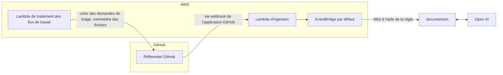

## Caractéristiques (actuelles et prévues)

- [x] Générer automatiquement des documents mis à jour pour votre référentiel à l'aide de Chat GPT et ouvrir une demande de tirage avec les modifications
- [ ] Générer des commentaires sur votre code à l'aide de Chat GPT et ouvrir une demande de tirage avec le code mis à jour
- [ ] Utiliser un assistant de chatbot pour répondre aux questions sur votre référentiel

## Commencer avec l'application GitHub

### Installation

Pour installer Evergreen Docs, visitez simplement le [GitHub Marketplace](https://github.com/apps/evergreen-docs) et cliquez sur le bouton "Installer". De là, vous pouvez choisir les référentiels sur lesquels vous souhaitez installer l'application et terminer le processus d'installation.

### Préparer votre référentiel

#### Fichier `evergreeen.config.json`

Avant de pouvoir utiliser Evergreen Docs, vous devez créer un fichier evergreen.config.json à la racine de votre référentiel. Ce fichier contient les paramètres de configuration de l'application, tels que le nom du référentiel, la description et les sections de la documentation à générer.

Voici un exemple de fichier evergreen.config.json:

```jsonc
{
  "name": "Evergreen Docs",
  "description": "Votre description ici",
  "generates": [
    {
      "preset": "readme",
      "path": "README.md",
      "sections": [
        { "name": "Vue d'ensemble" }
        // ...
      ]
    }
  ]
}
```

Une fois que vous avez créé le fichier evergreen.config.json, il suffit de le commettre dans votre référentiel dans la branche principale. L'application générera automatiquement une demande de tirage avec vos documents mis à jour dans les 10 minutes.

## Exécution locale

### Prérequis

- [Node.js](https://nodejs.org/en/)
- [Yarn](https://yarnpkg.com/)

### Installation

1. Cloner le repo

```sh
git clone https://github.com/EvergreenDocs/EvergreenDocs
```

2. Installer les packages NPM

```sh
yarn install
```

3. Définir les variables d'environnement (assurez-vous que votre environnement cli aws est configuré)

```sh
export OPENAI_API_KEY=<votre clé API OpenAI>
export SST_STAG=<l'une des étapes de développement>
```

4. Exécuter l'application

```sh
yarn sst:dev
```

5. Déclencher des événements GitHub

## Déploiement

Pour déployer l'application, vous devez avoir installé le [CLI Serverless Stack](https://serverless-stack.com/). Une fois que vous avez installé le CLI, vous pouvez déployer l'application en exécutant la commande suivante:

```sh
yarn deploy
```

## Architecture



## Licence

Distribué sous la licence MIT. Voir `LICENSE` pour plus d'informations