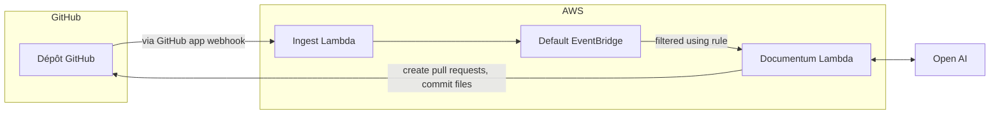

## A propos

Evergreen Docs est une application Github qui facilite la mise à jour de la documentation de votre dépôt. En utilisant les capacités linguistiques avancées de Chat GPT et en s'intégrant à Github, Evergreen Docs peut mettre à jour automatiquement votre documentation au fur et à mesure que votre code évolue.

Avec ses paramètres hautement configurables via un fichier evergreen.config.json, Evergreen Docs peut être adapté à vos besoins spécifiques. Notre équipe travaille également sur une application web qui vous permettra de personnaliser davantage l'application, ainsi que de poser des questions sur votre dépôt et de recevoir des réponses.

## Fonctionnalités (actuelles et prévues)

- [x] Générer automatiquement une documentation mise à jour pour votre dépôt en utilisant Chat GPT et ouvrir une demande de tirage avec les modifications
- [ ] Générer des commentaires sur votre code en utilisant Chat GPT et ouvrir une demande de tirage avec le code mis à jour
- [ ] Utiliser un assistant de chat bot pour répondre aux questions sur votre dépôt

## Commencer avec l'application GitHub

### Installation

Pour installer Evergreen Docs, rendez-vous simplement sur le [GitHub Marketplace](https://github.com/apps/evergreen-docs) et cliquez sur le bouton "Installer". De là, vous pouvez choisir les dépôts sur lesquels vous souhaitez installer l'application et terminer le processus d'installation.

### Préparer votre dépôt

#### Fichier `evergreeen.config.json`

Avant de pouvoir utiliser Evergreen Docs, vous devez créer un fichier evergreen.config.json à la racine de votre dépôt. Ce fichier contient les paramètres de configuration de l'application, tels que le nom du dépôt, la description et les sections de la documentation à générer.

Voici un exemple de fichier evergreen.config.json:

```jsonc
{
  "name": "Evergreen Docs",
  "description": "Votre description ici",
  "generates": [
    {
      "preset": "readme",
      "path": "README.md",
      "sections": [
        { "name": "Aperçu" }
        // ...
      ]
    }
  ]
}
```

Une fois que vous avez créé le fichier evergreen.config.json, il vous suffit de le commiter dans votre dépôt dans la branche principale. L'application générera automatiquement une demande de tirage avec votre documentation mise à jour dans les 10 minutes.

## Exécution locale

### Prérequis

- [Node.js](https://nodejs.org/en/)
- [Yarn](https://yarnpkg.com/)

### Installation

1. Cloner le repo

```sh
git clone https://github.com/EvergreenDocs/EvergreenDocs
```

2. Installer les packages NPM

```sh
yarn install
```

3. Définir les variables d'environnement (assurez-vous que votre environnement cli aws est configuré)

```sh
export OPENAI_API_KEY=<votre clé d'API OpenAI>
export SST_STAG=<une des étapes de développement>
```

4. Exécuter l'application

```sh
yarn sst:dev
```

5. Déclencher les événements GitHub

## Déploiement

Pour déployer l'application, vous devez avoir installé le [Serverless Stack CLI](https://serverless-stack.com/). Une fois que vous avez installé le CLI, vous pouvez déployer l'application en exécutant la commande suivante:

```sh
yarn deploy
```

## Architecture



## Licence

Distribué sous la licence MIT. Voir `LICENSE` pour plus d'informations.