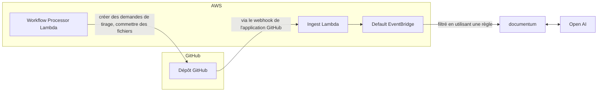

# Documentation Evergreen

## Fonctionnalités (actuelles et prévues)

- [x] Générer automatiquement une documentation mise à jour pour votre dépôt en utilisant Chat GPT et ouvrir une demande de tirage avec les modifications
- [ ] Générer des commentaires sur votre code en utilisant Chat GPT et ouvrir une demande de tirage avec le code mis à jour
- [ ] Utiliser un assistant de chatbot pour répondre aux questions sur votre dépôt

## Commencer avec l'application GitHub

### Installation

Pour installer Evergreen Docs, il suffit de visiter le [GitHub Marketplace](https://github.com/apps/evergreen-docs) et de cliquer sur le bouton "Installer". À partir de là, vous pouvez choisir les dépôts sur lesquels vous souhaitez installer l'application et terminer le processus d'installation.

### Préparation de votre dépôt

#### Fichier `evergreen.config.json`

Avant de pouvoir utiliser Evergreen Docs, vous devrez créer un fichier `evergreen.config.json` à la racine de votre dépôt. Ce fichier contient les paramètres de configuration de l'application, tels que le nom du dépôt, la description et les sections de la documentation à générer.

Voici un exemple de fichier `evergreen.config.json` :

```jsonc
{
  "name": "Evergreen Docs",
  "description": "Votre description ici",
  "generates": [
    {
      "preset": "readme",
      "path": "README.md",
      "sections": [
        { "name": "Aperçu" }
        // ...
      ]
    }
  ]
}
```

Une fois que vous avez créé le fichier `evergreen.config.json`, il suffit de le commettre dans votre dépôt dans la branche principale. L'application générera automatiquement une demande de tirage avec votre documentation mise à jour dans les 10 minutes.

## Exécution en local

### Prérequis

- [Node.js](https://nodejs.org/en/)
- [Yarn](https://yarnpkg.com/)

### Installation

1. Clonez le dépôt

```sh
git clone https://github.com/EvergreenDocs/EvergreenDocs
```

2. Installez les packages NPM

```sh
yarn install
```

3. Définissez les variables d'environnement (assurez-vous que votre environnement aws cli est configuré)

```sh
export OPENAI_API_KEY=<votre clé API OpenAI>
export SST_STAG=<l'une des étapes de développement>
```

4. Exécutez l'application

```sh
yarn sst:dev
```

5. Déclenchez des événements GitHub

## Déploiement

Pour déployer l'application, vous devez avoir le [Serverless Stack CLI](https://serverless-stack.com/) installé. Une fois que vous avez installé la CLI, vous pouvez déployer l'application en exécutant la commande suivante :

```sh
yarn deploy
```

## Architecture



## Licence

Distribué sous la licence MIT. Voir `LICENSE` pour plus d'informations.