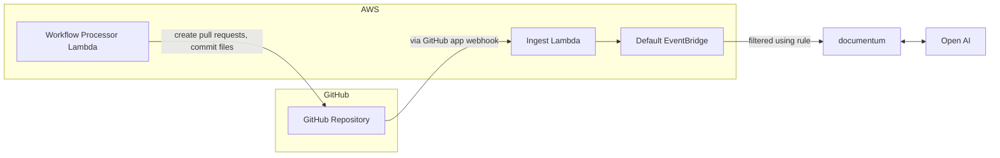

# Evergreen Docs

## Features (Current & Planned)

- [x] Automatically generate updated documentation for your repository using Chat GPT and open a Pull Request with the changes
- [ ] Generate comments on your code using Chat GPT and open a Pull Request with the updated code
- [ ] Use a chat bot assistant for answering questions about your repository

## Getting Started With The GitHub App

### Installing

To install Evergreen Docs, simply visit the [GitHub Marketplace](https://github.com/apps/evergreen-docs) and click the "Install" button. From there, you can choose the repositories you want to install the app on and complete the installation process.

### Preparing Your Repository

#### `evergreeen.config.json` File

Before you can use Evergreen Docs, you'll need to create a evergreen.config.json file in the root of your repository. This file contains the configuration settings for the app, such as the repository's name, description, and the sections of the documentation to be generated.

Here's an example of a evergreen.config.json file:

```jsonc
{
  "name": "Evergreen Docs",
  "description": "Your description here",
  "generates": [
    {
      "preset": "readme",
      "path": "README.md",
      "sections": [
        { "name": "Overview" }
        // ...
      ]
    }
  ]
}
```

Once you've created the evergreen.config.json file, simply commit it to your repository in the main branch. The app will automatically generate a Pull Request with your updated documentation within 10 minutes.

## Running Locally

### Prerequisites

- [Node.js](https://nodejs.org/en/)
- [Yarn](https://yarnpkg.com/)

### Installation

1. Clone the repo

```sh
git clone https://github.com/EvergreenDocs/EvergreenDocs
```

2. Install NPM packages

```sh
yarn install
```

3. Set environment variables (make sure your aws cli environment is configured)

```sh
export OPENAI_API_KEY=<your OpenAI API key>
export SST_STAG=<one of the development stages>
```

4. Run the app

```sh
yarn sst:dev
```

5. Trigger GitHub events

## Deployment

To deploy the app, you must have the [Serverless Stack CLI](https://serverless-stack.com/) installed. Once you have the CLI installed, you can deploy the app by running the following command:

```sh
yarn deploy
```

## Architecture



## License

Distributed under the MIT License. See `LICENSE` for more information
