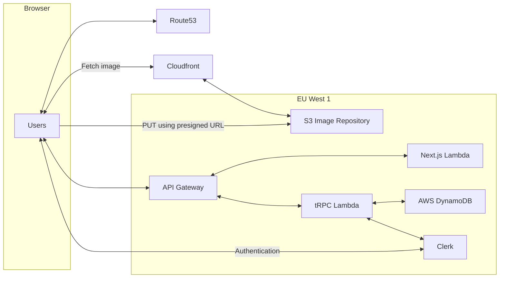

```mermaid
graph LR
  users[Users]
  route53[Route53]
  apiGateway[API Gateway]
  next[Next.js Lambda]
  trpc[tRPC Lambda]
  dynamo[AWS DynamoDB]
  s3[S3 Image Repository]
  cloudfront[Cloudfront]
  clerk[Clerk]


  subgraph Browser
      users
  end

  users <--> route53
  users <-- Fetch image --> cloudfront <--> s3


  subgraph EU West 1
      users -- PUT using presigned URL --> s3

      users <--> apiGateway  <---> next
      apiGateway <--> trpc <--> dynamo

      trpc <--> clerk
      users <-- Authentication --> clerk
  end
```
